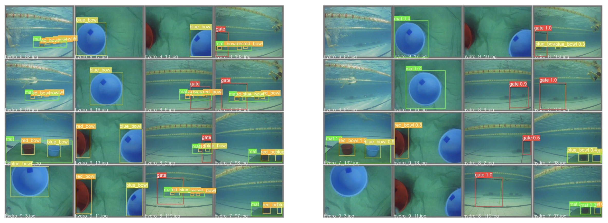

# Using Synthetic Data in Training Deep Neural Networks for Real-World Underwater Objects Recognition

Vladislav A. Plotnikov
plotnikovva@student.bmstu.ru
vladislav.a.plotnikov@yandex.ru

Yaroslav M. Kamenev
kamenev.yar@gmail.com

Vladimir V. Serebrenny
vsereb@bmstu.ru

**Abstract.** Convolutional neural networks are widely used to solve the problem of object recognition in images and have many advantages over classical image processing algorithms. However, training such neural networks requires a large dataset, the collection and labeling of which are time-consuming, especially for underwater objects. Underwater data collection involves full-scale trips to a pool or open water and requires waterproof equipment. This article explores the use of the computer simulator and domain randomization, as well as the use of a generative neural network to collect data and use it in training convolutional neural networks for recognizing underwater objects. Virtual simulator built on the Unity engine was used to visualize underwater scenes with different camera positions and underwater objects, visual effects, as well as various textures and objects. The generative neural network CycleGAN was used to transform synthetic data to a “real” form. The authors of the article prepared several datasets containing real, semi-synthetic and fully synthetic images, which were used to train the YOLOv5 convolutional neural network and compared the quality of object recognition on a validation set consisting of real data. For training, objects were selected from the SAUVC underwater robotics competition tasks.

**Keywords.** *Convolutional neural networks, object recognition, underwater robotics, domain randomization, CycleGAN, YOLOv5*

## Introduction

Training neural networks requires a large dataset, the collection and labeling of which are time-consuming, especially for underwater objects. 
Underwater data collection involves full-scale trips to a pool or open water and requires waterproof equipment.

Tests of the ROV Cousteau-2 in the swimming pool

## Related Work

### Dataset

Dataset was collected using the Unity game engine.
Script for randomization camera positions and environment (fog and textures) was designed. 
After randomizing, script generates bounding boxes for the objects on the screen and creates text file with bounding boxes information, then takes screenshot.

View of underwater scene from Unity Editor

Script works in “rounds”. This system was designed to ease the collection and editing of datasets.
Rounds:
- **round_1** - randomized fog and camera position;
- **round_2** - round_1 with randomized underwater props textures;
- **round_3** - round_1 with randomized pool textures;
- **round_0** - round_1 with randomized underwater props and pool textures;

Camera is pointed at one of the props, each 100 positions new prop is selected

Examples of one image in 4 rounds, clockwise: round_1 (upper left corner), round_2, round_0, round_3

### Training on real data

Neural net: YOLOv5m

Training parameters:
- GPU: Nvidia Quadro P4000
- framework: PyTorch 
- 869 images total: 732 in train set, 137 in validation set;
- image size: 640x640
- 300 epochs
- batch size - 16
- data augmentation

Train batch

Metrics

Validaton on real data

### Training on synthetic data

Neural net: YOLOv5m

Training parameters:
- Same as on real data
- 500 images total: 400 in train set, 100 in validation set;

Train batch

Training on round_1 (randomized fog and camera position) and round_3 (as round_1 with randomized pool textures) data show best results

Training on fully randomized data show lower quality on validation data

Metrics

Validaton on real data

Validaton on real data

### Synthetic dataset enhancement

Generative adversarial network - CycleGAN
Style transferring from simulation to reality

CycleGAN unpaired and unlabeled training data

CycleGAN enhancement

Training CycleGAN

Metrics

Validation round_gan on synthetic data

Validation round_gan on real data

Comparing round_1 and round_gan predictions

### Training round_gan on small amount of real data

Trained on:
- 366 real images (⅓ from original dataset) (293 train, 73 validation images);
- 50 epochs;

Metrics

Validation round_refined_gan on real data

## Results

Results table

best simulation and simulation after GAN refinement

real and gan+real

## Conclusion

- Training on randomized data from the simulator shows a low quality of recognition on the validation set;
- Using CycleGAN to enhance synthetic images in the dataset improved the quality of real objects recognition;
- Training on enhanced data and small amount of real data gave almost the same recognition quality as training on real data only.

## References

1. Plotnikov, Vladislav & Akhtyamov, T. & Kopanev, Pavel & Serebrenny, Vladimir. (2022). Classical and neural network approaches to object detection in underwater robotics competitions. AIP Conference Proceedings. 2383. 020021. 10.1063/5.0083975. 

2. Nogues, F. C., Huie, A., & Dasgupta, S. (2018). Object Detection using Domain Randomization and Generative Adversarial Refinement of Synthetic Images. arXiv. https://doi.org/10.48550/ARXIV.1805.11778

3. Tobin, J., Fong, R., Ray, A., Schneider, J., Zaremba, W., & Abbeel, P. (2017). Domain Randomization for Transferring Deep Neural Networks from Simulation to the Real World. arXiv. https://doi.org/10.48550/ARXIV.1703.06907

4. Borrego, J., Dehban, A., Figueiredo, R., Moreno, P., Bernardino, A., & Santos-Victor, J. (2018). Applying Domain Randomization to Synthetic Data for Object Category Detection. arXiv. https://doi.org/10.48550/ARXIV.1807.09834

5. Zhu, J.-Y., Park, T., Isola, P., & Efros, A. A. (2017). Unpaired Image-to-Image Translation using Cycle-Consistent Adversarial Networks. arXiv. https://doi.org/10.48550/ARXIV.1703.10593

6. Liu, H., Song, P., & Ding, R. (2020). WQT and DG-YOLO: towards domain generalization in underwater object detection. arXiv. https://doi.org/10.48550/ARXIV.2004.06333

7. Tremblay, J., Prakash, A., Acuna, D., Brophy, M., Jampani, V., Anil, C., To, T., Cameracci, E., Boochoon, S., & Birchfield, S. (2018). Training Deep Networks with Synthetic Data: Bridging the Reality Gap by Domain Randomization. arXiv. https://doi.org/10.48550/ARXIV.1804.06516

