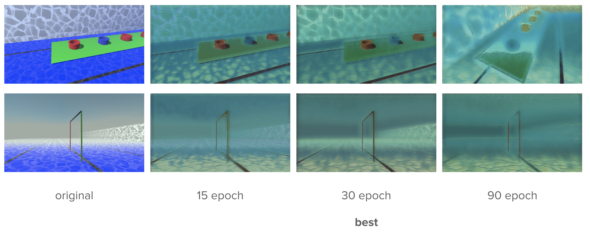
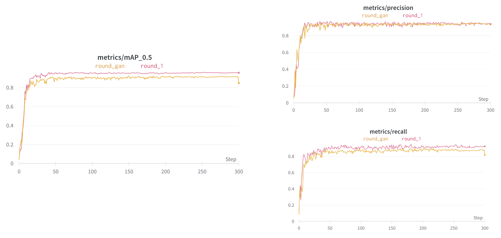
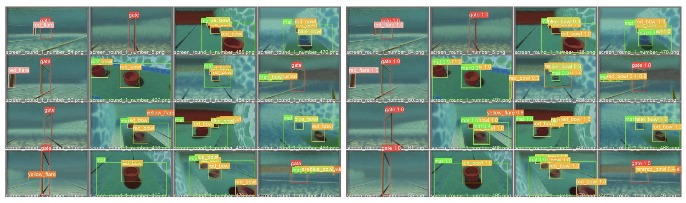
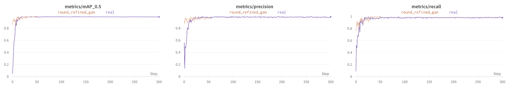
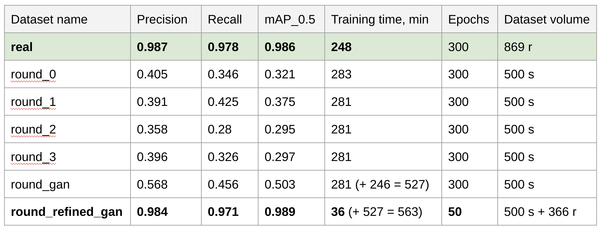

# Использование синтетических данных при обучении глубоких нейронных сетей для распознавания подводных объектов в реальном мире

Vladislav A. Plotnikov
plotnikovva@student.bmstu.ru
vladislav.a.plotnikov@yandex.ru

Yaroslav M. Kamenev
kamenev.yar@gmail.com

Vladimir V. Serebrenny
vsereb@bmstu.ru

**Abstract.** Конволюционные нейронные сети широко используются для решения задачи распознавания объектов на изображениях и имеют много преимуществ перед классическими алгоритмами обработки изображений. Однако для обучения таких нейронных сетей требуется большой набор данных, сбор и маркировка которых занимает много времени, особенно для подводных объектов. Сбор данных под водой предполагает полномасштабные поездки в бассейн или на открытую воду и требует водонепроницаемого оборудования. В данной статье рассматривается использование компьютерного симулятора и рандомизации домена, а также применение генеративной нейронной сети для сбора данных и их использования при обучении сверточных нейронных сетей для распознавания подводных объектов. Виртуальный симулятор, построенный на движке Unity, использовался для визуализации подводных сцен с различным положением камеры и подводных объектов, визуальных эффектов, а также различных текстур и объектов. Генеративная нейронная сеть CycleGAN использовалась для преобразования синтетических данных в "реальную" форму. Авторы статьи подготовили несколько наборов данных, содержащих реальные, полусинтетические и полностью синтетические изображения, которые были использованы для обучения сверточной нейронной сети YOLOv5, и сравнили качество распознавания объектов на валидационном наборе, состоящем из реальных данных. Для обучения были выбраны объекты из заданий соревнований по подводной робототехнике SAUVC.

**Keywords.** *Сверточные нейронные сети, распознавание объектов, подводная робототехника, рандомизация доменов, CycleGAN, YOLOv5*

## Введение

Нейросети часто применяются для задачи распознавания объектов под водой и имеют множество преимуществ перед классическими алгоритмами обработки изображений [https://www.researchgate.net/publication/360196795_Classical_and_neural_network_approaches_to_object_detection_in_underwater_robotics_competitions, https://www.researchgate.net/publication/339465579_Underwater_Object_Detection_and_Tracking , https://www.researchgate.net/publication/359195058_Underwater_object_detection_architectures_and_algorithms_-_a_comprehensive_review , https://www.researchgate.net/publication/359547226_A_Survey_on_Underwater_Object_Detection]. Однако обучение таких нейросетей требует большого набора данных, сбор и разметка которых занимают много времени, особенно для подводных объектв. Процесс сбора данных требует неоднократных выездов в бассейн или на открытую воду, что не всегда возможно. 

Применение симулятора может значительно уменьшить затраты на сбор данных, сбор и разметка изображений будут выполняться автоматически. Однако, симуляционная среда не сможет полностью имитировать реальные условия и обученная на симуляции нейросеть не будет работать в реальном мире с приемлемым качеством. Такая проблема носит название reality-gap [Object Detection using Domain Randomization and Generative Adversarial Refinement of Synthetic Images].

Cуществует несколько подходов для уменьшения reality-gap. Первый подход - domain randomization для сцены в симуляторе. При этом можно рандомизировать несколько параметров сцены, например, цвет объектов, текстуры, освещение и т.д. Такой подход сильно разнообразит обучающие данные, что позволит обучить нейросеть выделять общие признаки объекта не привязываясь к особенностям отображения в симуляции, что позволит значительно увеличить качество распознавания уже в реальном мире.

Второй подход основан на улучшении синтетических изображений. Для этого применяются генеративно состязательные нейросети, такие как CycleGAN [Unpaired Image-to-Image Translation using Cycle-Consistent Adversarial Networks] и Pix2Pix [Image-to-Image Translation with Conditional Adversarial Networks]. Они позволяют преобразовывать синтетические изображения в реальные и наоборот. 

В этой статье рассматривается задача распознавания подводных объектов с соревнований по автономной подводной робототехнике SAUVC в Сингапуре [https://www.researchgate.net/publication/360196795_Classical_and_neural_network_approaches_to_object_detection_in_underwater_robotics_competitions]. Нейросеть YOLOv5 [YOLOv5: Training Object Detection Models at Scale] была использована для реализации распознавания и сравнения приведенных выше методов уменьшения reality-gap.

Данная работа имеет следующую структуру: в следующем разделе приведено описание обучения эталонной модели на реальных данных, далее описан процесс сбора синтетических данных, далее в разделах описано применение методов domain randomization и улучшения изображений с помощью GAN для уменьшения reality-gap, после этого приведены результаты обучения на синтетических и полусинтетических данных и проведено сравнение методов с обучением на реальных данных. В заключительном разделе приведено краткое изложение полученных результатов и выводов.

## Сбор реальных данных и обучение эталонной модели

Для того, чтобы оценить качество распознавания моделей, которые были обучены на синтетических данных, был собран датасет с реальными данными. На реальных данных была обучена эталонная модель YOLOv5 методом transfer learning [Zhuang, F., Qi, Z., Duan, K., Xi, D., Zhu, Y., Zhu, H., Xiong, H., & He, Q. (2019). A Comprehensive Survey on Transfer Learning. arXiv. https://doi.org/10.48550/ARXIV.1911.02685], с которой потом проводилось сравнение качества.

Датасет состоит из 869 реальных изображений подводных объектов разрешением 640x480, собранных в бассейне спорткомплекса МГТУ им. Н.Э. Баумана. Объекты были сфотографированы с разных ракурсов и дистанций. Далее каждое изображение было размечено вручную с помощью программы [GitHub LabelImg, https://github.com/tzutalin/labelImg, last accessed 2022/11/28]. Далее данные были разделены на обучающую и тестовую выборки в соотношении 85% к 15%. Обучение проводилось с использованием фреймворка PyTorch на GPU Nvidia Quadro P4000. Количество эпох обучения - 300. 

На каждой эпохе обучения изображения подвергались различным алгоритмам data augmentation. Пример батча изображений из обучающей выборки с примененными аугментациями представлен на рисунке 1. 

Train batch

Ниже представлены метрики качества обучения модели при тестировании на валидационной выборке.

Metrics

Ниже представлен пример распознавания обученной модели. Слева - ground truth, справа - результат распознавания. Как видно нейросеть научилась хорошо распознавать объекты, даже если они находятся на большом расстоянии от камеры, повернуты на 90 градусов и т.д.

Validaton on real data

## Генерация синтетических данных с использованием рандомизации сцены

Соревнования SAUVC проходят в стандартном плавательном бассейне с максимальной глубиной 2 метра, в котором робот должен выполнить ряд заданий, взаимодействуя с различными подводными объектами. Положение всех объектов на дне определено правилами соревнований, при этом некоторые объекты могут передвинуть в начале каждой попытки выполнения. В целом можно выделить 7 классов объектов:
    
* 1 - gate
* 2 - red_flare
* 3 - yellow_flare
* 4 - red_bowl
* 5 - blue_bowl
* 6 - mat
* 7 - gate_qualification 

Для генерации синтетических данных была смоделирована сцена в симуляторе Unity, максимально приближенно повторяющая реальный бассейн с объектами. Для этого были сделаны 3d модели плавательного бассейна и необходимых объектов, которые затем были расположены в соответствии с правилами соревнований.

Автоматический сбор синтетических данных был реализован с помощью скрипта, который выполняет рандомизацию сцены, затем генерирует прямоугольные bbox для каждого объекта, попадающего в кадр, а после этого сохраняет изображение и аннотации в формате YOLO. 

Скрипт позволяет рандомизировать следующие параметры: 

  * Положение камеры
  * Положение, цвета и текстуры объектов
  * Положение и цвет источников света
  * Наличие, интенсивность и цвет тумана   

View of underwater scene from Unity Editor

Для исследования влияния рандомизации на качество распознавания было собрано 4 датасета с разными уровнями рандомизации сцены:

1. **round_1** - рандомизация тумана и положения камеры;
2. **round_2** - round_1 с рандомизированными текстурами подводного подводных обхектов;
3. **round_3** - раунд_1 с рандомизированными текстурами бассейна;
4. **round_0** - раунд_1 и рандомизация текстур всех объектов и бассейна;

На всех изображениях объект находится в центре кадра. 

Всего было собрано по 500 синтетических изображений для каждого из датасетов. 

Examples of one image in 4 rounds, clockwise: round_1 (upper left corner), round_2, round_0, round_3

### Обучение на синтетических данных

Как упоминалось в разделе выше, было проведено 4 раунда обучения на синтетических данных. Параметры обучения остались такие же как и для реальных данных, кроме размера датасета.

Пример батча изображений из обучающей выборки представлен на рисунке ниже.

Train batch

Ниже представлены метрики качества обучения модели при тестировании на валидационной выборке.

Metrics

Training on round_1 (randomized fog and camera position) and round_3 (as round_1 with randomized pool textures) data show best results

Training on fully randomized data show lower quality on validation data

Ниже представлены примеры распознавания обученной модели на синтетических и реальных данных. Слева сверху - synthetic ground truth, справа сверху - результат распознавания на валидационных данных из синтетического датасета, слева снизу - реальный ground truth, справа снизу - результат распознавания на реальных данных.

Validaton on real data

Validaton on real data

По результатам обучения на синтетических данных можно сделать следующие выводы:
- нейросеть научилась хорошо распознавать объекты на изображениях, полученных из симулятора;
- распознавание объектов на реальных изображениях крайне низкого качества.

### Улучшение синтетических данных с помощью генеративной нейронной сети

Для улучшения качества синтетических данных была использована генеративная нейронная сеть CycleGAN. Данная нейросеть позволяет осуществлять трансфер стиля между двумя изображениями. В нашем случае мы хотим преобразовать синтетические данные в данные, похожие на реальные.

Для обучения CycleGAN был использован датасет round_1 с синтетическими данными и датасет с реальными данными. На изображении ниже представлены примеры изображений из двух датасетов (слева - синтетические данные, справа - реальные данные).

CycleGAN unpaired and unlabeled training data

В процессе обучения эмпирическим путем была выбрана модель на 30-й эпохе. Результаты преобразования на разных эпохах представлены на рисунке ниже. 

Training CycleGAN

Далее изображения из датасета round_1 с синтетическими данными были улучшены с помощью обученной CycleGAN. Полученный новый датасет был использован для обучения модели YOLOv5. Ниже представлены графики метрик на валидационных данных.

Metrics

Ниже на рисунке представлен пример распознавания YOLOv5 обученной на улучшенных синтетических данных (слева - ground truth, справа - результат распознавания на улучшенных синтетических данных).

Validation round_gan on synthetic data

На рисунке ниже представлен пример распознавания реальных данных (слева - ground truth, справа - результат распознавания на реальных данных).

Validation round_gan on real data

На рисунке ниже представлено сравнение распознавания реальных изображений моделью обученной на синтетических данных (слева) и моделью обученной на улучшенных синтетических данных (справа).

Comparing round_1 and round_gan predictions

По результатам сравнения можно сделать вывод, что метод улучшения синтетических изображений с помощью CycleGAN позволяет значительно повысить качество распознавания на реальных данных.

### Дообучение на малом объеме реальных данных

Был также проведен эксперимент, в котором модель, обученная на улучшенных синтетических данных была дообучена на малом количестве реальных данных. Объем датасета для дообучения составил треть от исходного объема датасета с реальными данными - 366 изображений. 

Ниже представлены метрики рассчитанные на валидационных данных.

Metrics

Как видно по графикам, дообучение до сопостовимого качества с моделью обученной на реальных данных заняло 50 эпох. На рисунке ниже представлено сравнение распознавания реальных изображений моделью дообученной на малом объеме реальных данных (слева) и моделью обученной на большом объеме реальных данных (справа).

Validation round_refined_gan on real data

## Результаты

В таблице ниже представлены значения метрик для всех моделей, которые были обучены в ходе данного проекта, рассчитанных на валидационной выборке из датасета с реальными данными. Также в таблице для каждой модели приведены: время обучения, количество эпох обучения, размер датасета.

Table 1. Validation metrics, training time, number of epochs, dataset volume (“real” - real data, "round_1" - fog and camera position randomization, "round_2" - as "round_1" with randomized underwater object textures, "round_3" - as "round_1" with randomized pool textures, "round_0" - as "round_1" and texture randomization of all objects and the pool, "round_gan" - "round_1" enhanced with CycleGAN, "round_refined_gan" - "round_gan" fine-tuned with small amount of real data)

Results table

Ниже на рисунке представлены confusion matrices, рассчитанные на валидационной выборке датасета состоящего из реальных данных: слева сверху модель обученная на датасете round_1, справа сверху модель обученная на улучшенных генеративной нейросетью синтетических данных, слева снизу эталонная модель обученная на реальных данных, справа снизу модель обученная на улучшенных синтетических и дообученная на малом количестве реальных данных.

best simulation and simulation after GAN refinement

real and gan+real

## Conclusion

В ходе данного проекта были рассмотрены методы обучения модели для распознавания объектов с использованием синтетических данных. Для обучения модели распознавания был использован симулятор и автоматическая генерация данных, которая позволяет в кратчайшие сроки получить датасет любого объема. Для уменьшения reality-gap были использованы два метода - рандомизация сцены и улучшение синтетических данных с помощью GAN. Из четырех моделей обученных на синтетических данных с разной степенью рандомизации сцены лучшее качество распознавания на реальных данных показала модель, которая была обучена на данных с рандомизацией положения камеры, тумана и текстур бассейна. Модели обученные на данных с рандомизацией текстур объектов показали худшее качество распознавания на реальных данных. Это связано с тем, что в датасете присутствуют объекты, которые идентичны по форме и отличаются только цветом. Метод улучшения синтетических данных с помощью GAN позволил значительно увеличить качество распознавания на реальных данных, но при этом общее время обучения увеличивается за счет обучения GAN. Fine-tuning на небольшом количестве реальных данных позволил добиться сопоставимого качества распознавания с эталонной моделью, обученной только на реальных данных. Таким образом, рассмотренные методы обучения на синтетических данных позволяют эффективно обучить модель распознавания объектов до уровня, достаточного для использования в реальных приложениях. При этом общее время обучения сокращается в разы за счет того, что требуется минимальное количество реальных данных для fine-tuning. 

## Acknowledgements

Выражаем благодарность руководству спорткомплекса МГТУ им. Н.Э. Баумана за помощь в предоставлении бассейна для сбора датасета и проведения экспериментов.

## References

1. Plotnikov, Vladislav & Akhtyamov, T. & Kopanev, Pavel & Serebrenny, Vladimir. (2022). Classical and neural network approaches to object detection in underwater robotics competitions. AIP Conference Proceedings. 2383. 020021. 10.1063/5.0083975.
2. Priyadarshni, Divya & Kolekar, Maheshkumar. (2020). Underwater Object Detection and Tracking. 10.1007/978-981-15-0751-9_76.
3. Fayaz, Sheezan & Parah, Shabir & Qureshi, G.. (2022). Underwater object detection: architectures and algorithms – a comprehensive review. Multimedia Tools and Applications. 81. 10.1007/s11042-022-12502-1. 
4. Sarkar, Pratima & De, Sourav & Gurung, Sandeep. (2022). A Survey on Underwater Object Detection. 10.1007/978-981-19-0489-9_8. 
5. Nogue, Fernando & Huie, Andrew & Dasgupta, Sakyasingha. (2018). Object Detection using Domain Randomization and Generative Adversarial Refinement of Synthetic Images
6. Zhu, Jun-Yan & Park, Taesung & Isola, Phillip & Efros, Alexei. (2017). Unpaired Image-to-Image Translation Using Cycle-Consistent Adversarial Networks. 2242-2251. 10.1109/ICCV.2017.244. 
7. Isola, Phillip & Zhu, Jun-Yan & Zhou, Tinghui & Efros, Alexei. (2017). Image-to-Image Translation with Conditional Adversarial Networks. 5967-5976. 10.1109/CVPR.2017.632. 

